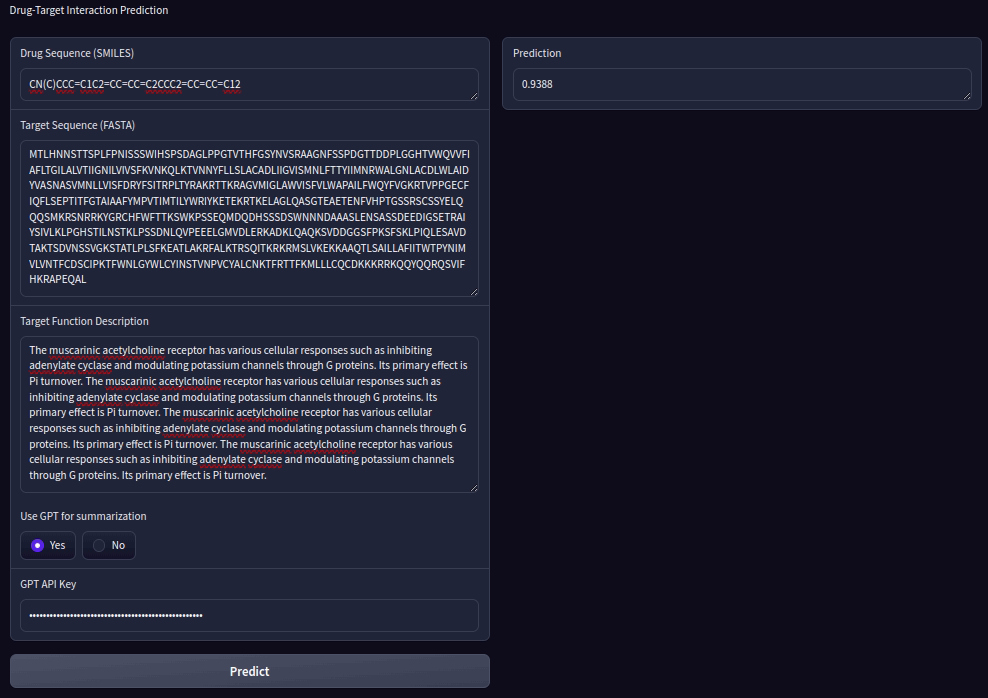

# MMF-DTI Demo

## Inputs

- SMILES: Drug sequences
  - The molecular properties are automatically computed. 
- FASTA: Target sequences
- Target function description: Public DB such as UniProt provided function infromation about each target sequence. SImply copy and paste it. 
  - If the text is too long (more than 512), it could be summarized by GPT-3.5 API. (recommended)
  - Or just you can truncated text.
- If you want to use GPT-3.5 API, please copy and paste the API key provided by OpenAI.

## Outut

- Predicted binding probability of  given durg-target pair.

## Installation & Run

- Type command `pip -r requirements.txt` to install requirements packages.
- Type command `pyhton ./run.py` to initialize the demo.
- In web-browser such as Google Chrome, type `http://127.0.0.1:7860` to access the demo.
- Fill out the required fields, and just click the **Predict** button.
- The first initialization require several minutes to download neccessary models' parameters. 